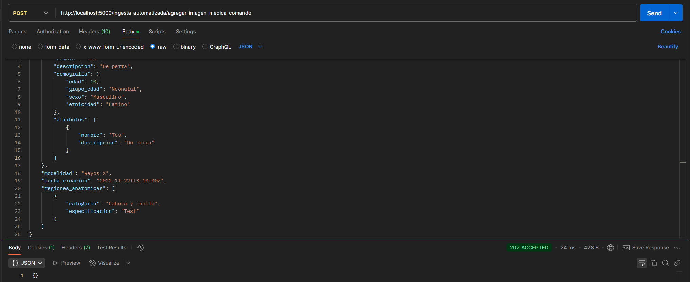

# Entrega Semana 5

A continuación presentamos la entrega de la semana cinco.

En esta entrega presentamos un microservicio con comunicacion asincrona (comandos y eventos) usando Apache Pulsar.

NO se espera tener el servicio completamente desarrollado, solo los comandos, consultas e infraestructura necesaria (tablas, repositorios, etc) para satisfacer los futuros escenarios de calidad (implemente lo necesario para eventualmente probarlo en la siguiente entrega).

# Instruccion de ejecucion del proyecto

1. Clonar el repositorio
2. Crear imagenes Docker para sta y notificaciones
```bash
docker build -f sta.Dockerfile -t sta .
```
```bash
docker build -f notificaciones.Dockerfile -t notificaciones .
```
3. Ejecutar el siguiente comando para desplegar toda la arquitectura
```bash
docker compose up -d
```
4. Una vez los proyectos terminen de subir puede ejecutar la coleccion de postman adjunta en el proyecto y ver su funcionamiento


# Escenarios de calidad

## 1. Soportar un aumento de centros de salud conectados
A medida que SaludTech expande sus operaciones a lo largo del continente americano, se agregan cientos de nuevos centros de salud a la plataforma, aumentando el volumen de datos procesados. El sistema debe escalar para poder procesar esto datos sin afectar el rendimiento.


## 2. Protección de datos anonimizados
Como parte del cumplimiento con regulaciones como HIPAA, los datos deben almacenarse y transmitirse de manera segura para evitar exposición de información sensible.


## 3. Monitoreo proactivo de la infraestructura
Implementar monitoreo en tiempo real para prevenir fallos antes de que afecten a los usuarios.


